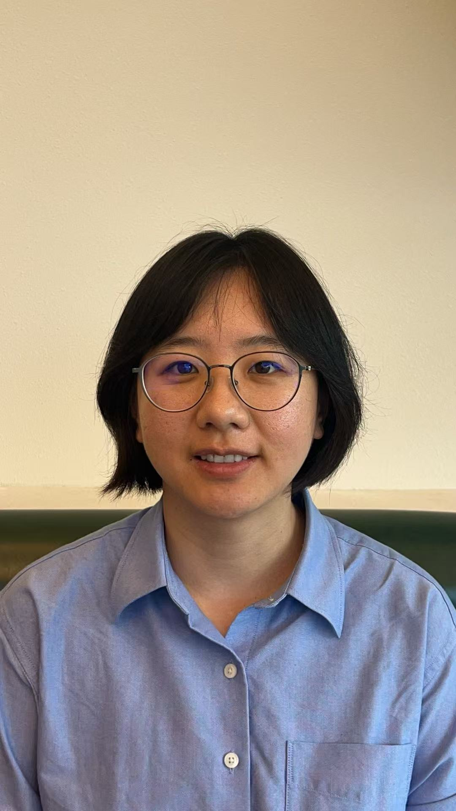

  
  

    <h1 class="intro-name">Fangyuan Li</h1>
    
PhD Candidate in Neuroscience

    
University of Copenhagen

    
Awake two-photon imaging · Astrocyte–neuron interactions · Neurovascular coupling · Sensory processing

    
<a href="https://github.com/fangyuanli-hub">GitHub</a> · <a href="mailto:fangyuanlicla@gmail.com">Email</a>

  

## About

I study how astrocytes shape brain activity and blood flow while mice actively sense their world,
by whisking and running, and how this changes with arousal state and age.
I image astrocytes, neurons and blood vessels together in awake mice,
supervised by Barbara Lykke Lind and Martin Lauritzen.

I also write here about ideas that don't fit in a paper. See the notes below.

## Methods I've developed

- An embedded cranial window that keeps the skull from regrowing for at least six months
- A standardized habituation protocol for awake imaging
- A DeepLabCut + Hilbert-transform pipeline for instantaneous whisking frequency
- An ABBA–QuPath workflow for brain-atlas registration and viral-expression mapping
